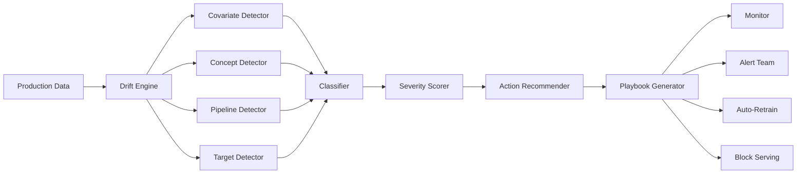
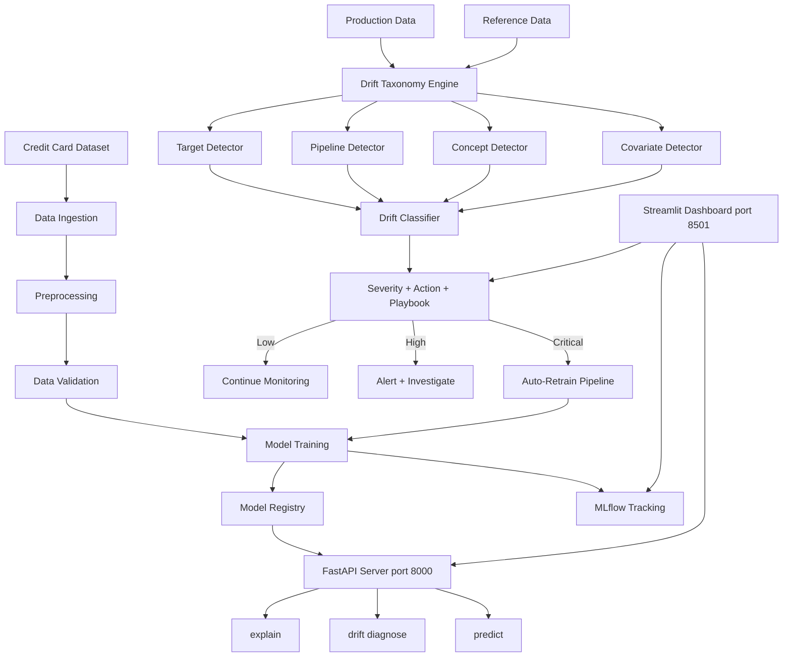
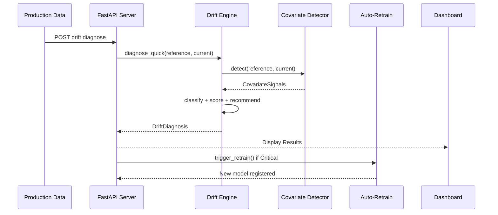
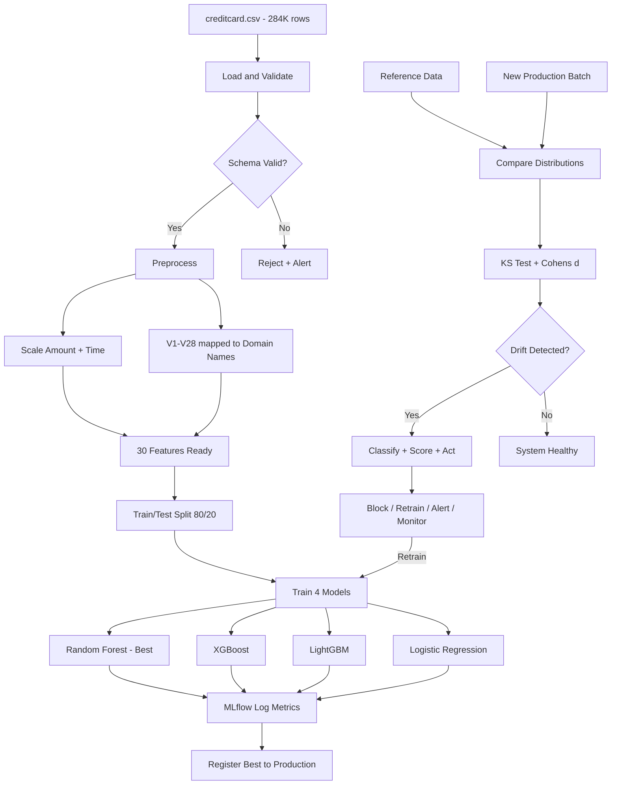
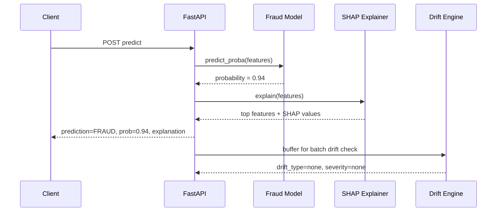
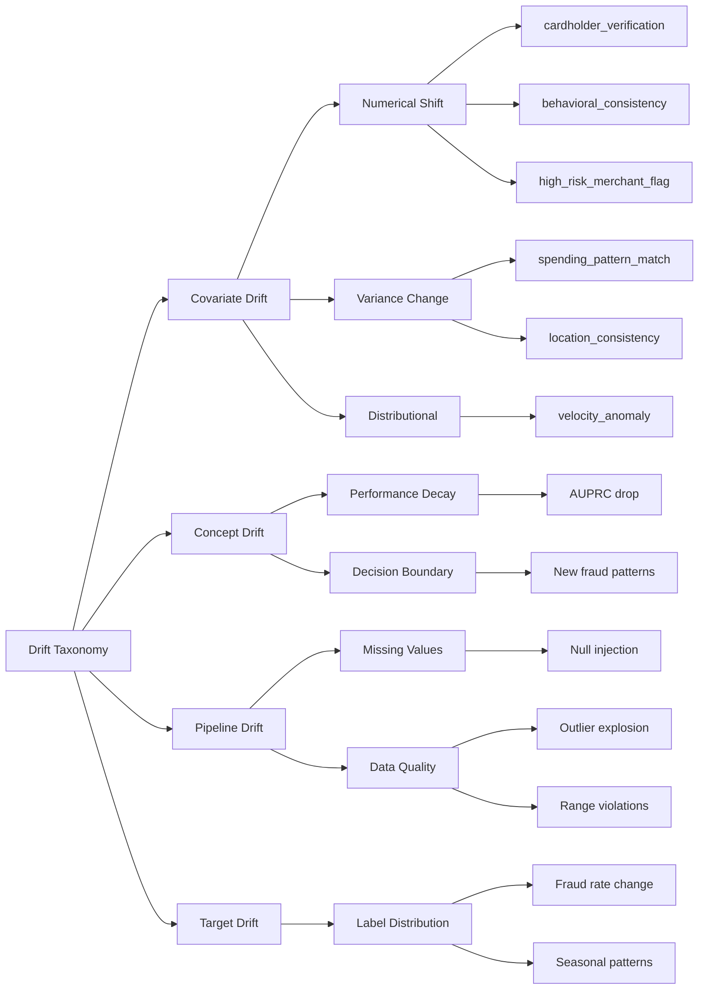
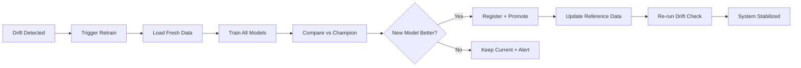

# 🔍 Drift Taxonomy Engine

> **A production-grade MLOps system for automated drift detection, classification, and response in fraud detection models.**

[](https://python.org)
[](https://fastapi.tiangolo.com)
[](https://mlflow.org)
[](https://docker.com)
[](LICENSE)

---

## 📋 Table of Contents

- [Project Overview](#-project-overview)
- [Problem Statement](#-problem-statement)
- [Architecture](#-architecture)
- [Data Flow](#-data-flow)
- [Drift Taxonomy](#-drift-taxonomy)
- [Tech Stack](#-tech-stack)
- [Project Structure](#-project-structure)
- [Quick Start](#-quick-start)
- [API Reference](#-api-reference)
- [Dashboard](#-dashboard)
- [Auto-Retrain Pipeline](#-auto-retrain-pipeline)
- [SHAP Explainability](#-shap-explainability)
- [Docker Deployment](#-docker-deployment)
- [Testing](#-testing)
- [Results](#-results)

---

## 🎯 Project Overview

### What is this?

The **Drift Taxonomy Engine** is an end-to-end MLOps platform that goes beyond simple model serving. It actively **monitors, diagnoses, classifies, and responds** to data drift in production ML systems — specifically applied to credit card fraud detection.

### Why does this matter?

In production ML systems, **87% of model failures** are caused by data drift — not model bugs. This project solves the complete drift lifecycle:

```
Data Changes → Detect Drift → Classify Type → Assess Severity → Recommend Action → Auto-Retrain → Redeploy
```

### Key Capabilities

| Capability | Description |
|-----------|-------------|
| 🔬 **Multi-type Drift Detection** | Covariate, concept, pipeline, and target drift |
| 🌳 **Taxonomy Classification** | Automatically classifies drift into actionable categories |
| 📊 **Severity Scoring** | Maps drift signals to none/low/medium/high/critical |
| 🎯 **Action Recommendation** | Monitor → Alert → Investigate → Retrain → Block |
| 📖 **Playbook Generation** | Step-by-step response plans with SLA and ownership |
| 🤖 **SHAP Explainability** | Per-prediction feature explanations |
| 🔄 **Auto-Retrain** | Automatic model retraining when drift exceeds thresholds |
| 🐳 **Docker Deployment** | One-command production deployment |
| 📈 **Real-time Dashboard** | Streamlit UI with live monitoring |

---

## 🚨 Problem Statement

### The Challenge

A credit card fraud detection model is deployed in production. Over time:
- Customer spending patterns change (covariate drift)
- Fraudster tactics evolve (concept drift)
- Data pipeline issues introduce corrupted data (pipeline drift)
- Fraud rate changes seasonally (target drift)

**Without drift monitoring**, the model silently degrades — missing fraud or creating false positives.

### Our Solution



---

## 🏗️ Architecture

### System Architecture



### Component Interaction



---

## 📊 Data Flow

### End-to-End Pipeline Flow



### Example: Single Transaction Flow



---

## 🌳 Drift Taxonomy

### Classification Hierarchy



### Detection Methods

| Drift Type | Detection Method | Threshold | Action |
|-----------|-----------------|-----------|--------|
| **Covariate** | KS test + Cohen's d | p < 0.001 AND d ≥ 0.5 | Retrain on shifted features |
| **Concept** | AUPRC/F1 decay vs baseline | > 10% degradation | Full model retrain |
| **Pipeline** | Null rate, range checks, sign flips | Issue-specific | Block + fix pipeline |
| **Target** | Chi-square on label distribution | p < 0.01 | Investigate + retrain |

### Severity → Action Matrix

```
                Pipeline    Concept     Covariate   Target      Mixed
Critical        BLOCK       RETRAIN     RETRAIN     RETRAIN     RETRAIN
High            BLOCK       RETRAIN     INVESTIGATE RETRAIN     RETRAIN
Medium          INVESTIGATE INC_RETRAIN ALERT       ALERT       INC_RETRAIN
Low             ALERT       ALERT       MONITOR     MONITOR     INVESTIGATE
```

---

## 🛠️ Tech Stack

| Layer | Technology | Purpose |
|-------|-----------|---------|
| **ML Models** | scikit-learn, XGBoost, LightGBM | Fraud classification |
| **Explainability** | SHAP | Feature-level prediction explanations |
| **API** | FastAPI + Uvicorn | REST serving (async, high-perf) |
| **Dashboard** | Streamlit + Plotly | Real-time monitoring UI |
| **Experiment Tracking** | MLflow | Metrics, params, artifacts, model registry |
| **Drift Detection** | SciPy (KS), Custom Engine | Statistical testing |
| **Data** | Pandas, NumPy, PyArrow | Processing + Parquet storage |
| **Containerization** | Docker + Compose | Reproducible deployment |
| **Testing** | Pytest | Unit + integration tests |
| **Config** | Pydantic Settings | Type-safe env-var config |

---

## 📁 Project Structure

```
drift-taxonomy-engine/
├── api/                          # FastAPI application
│   ├── main.py                   # App factory + CORS + routers
│   ├── dependencies.py           # Dependency injection
│   ├── routers/
│   │   ├── predictions.py        # /predict, /models, /features
│   │   └── drift.py              # /drift/diagnose, /drift/status
│   └── schemas/
│       ├── prediction.py         # Request/response models
│       └── drift.py              # Drift schemas
├── src/                          # Core business logic
│   ├── config/
│   │   ├── settings.py           # Pydantic Settings (env-var)
│   │   └── constants.py          # Enums, feature mapping, thresholds
│   ├── data/
│   │   ├── ingestion.py          # Data loading + reference storage
│   │   ├── preprocessing.py      # Scaling + domain name mapping
│   │   └── validation.py         # Schema + quality validation
│   ├── drift/
│   │   ├── engine.py             # Main orchestration engine
│   │   ├── classifiers.py        # Drift type classifier
│   │   ├── severity.py           # Severity scoring
│   │   ├── actions.py            # Action recommendation
│   │   ├── playbook.py           # Response playbook generation
│   │   └── detectors/
│   │       ├── covariate.py      # KS + Cohen's d
│   │       ├── concept.py        # Performance monitoring
│   │       ├── pipeline.py       # Data quality checks
│   │       └── target.py         # Label distribution
│   ├── models/
│   │   ├── predictor.py          # Inference engine
│   │   └── registry.py           # Model versioning + storage
│   ├── explainability/
│   │   └── shap_explainer.py     # SHAP-based explanations
│   └── features/
│       ├── feature_engineering.py # Importance computation
│       └── feature_store.py      # Feature metadata store
├── pipelines/
│   ├── training_pipeline.py      # End-to-end training + MLflow
│   ├── drift_pipeline.py         # Scheduled drift monitoring
│   └── auto_retrain_pipeline.py  # Drift-triggered retraining
├── dashboard/
│   ├── app.py                    # Main dashboard (KPIs, heatmap, alerts)
│   └── pages/
│       ├── 01_model_performance.py
│       ├── 02_drift_monitor.py
│       ├── 03_prediction_explorer.py
│       └── 04_action_playbook.py
├── scripts/
│   └── simulate_drift_and_diagnose.py  # Validation script
├── docker/
│   ├── Dockerfile                # Multi-stage build
│   └── docker-compose.yml        # Full stack deployment
├── tests/
│   └── unit/                     # 18+ unit tests
├── artifacts/                    # Generated at runtime
│   ├── models/                   # Serialized models + registry
│   ├── reports/                  # Drift reports (JSON)
│   └── references/               # Reference data (Parquet)
├── notebooks/                    # Research notebooks (3)
├── requirements.txt
├── pyproject.toml
└── Makefile
```

---

## 🚀 Quick Start

### Option 1: Docker (Recommended)

```bash
# Clone and start everything
git clone https://github.com/yourname/drift-taxonomy-engine.git
cd drift-taxonomy-engine
docker compose up --build

# Services:
#   API:       http://localhost:8000/docs
#   Dashboard: http://localhost:8501
#   MLflow:    http://localhost:5000
```

### Option 2: Local Development

```bash
# 1. Create virtual environment
python -m venv .drift
.drift\Scripts\activate   # Windows
source .drift/bin/activate  # Linux/Mac

# 2. Install dependencies
pip install -r requirements.txt

# 3. Train models
python -m pipelines.training_pipeline

# 4. Start services
uvicorn api.main:app --reload --port 8000          # API
python -m streamlit run dashboard/app.py --server.port 8501  # Dashboard
mlflow ui --port 5000                               # MLflow

# 5. Run drift validation
python scripts/simulate_drift_and_diagnose.py
```

---

## 📡 API Reference

### Predict Fraud

```bash
POST /api/v1/predict
```

```json
{
  "samples": [{
    "cardholder_verification": -2.5,
    "behavioral_consistency": 1.3,
    "high_risk_merchant_flag": 0.8,
    "transaction_amount": 0.5,
    "transaction_time": -0.2
  }],
  "model_name": "random_forest"
}
```

**Response:**
```json
{
  "predictions": [1],
  "probabilities": [0.94],
  "model_name": "random_forest",
  "model_version": "20260603_101330",
  "n_samples": 1,
  "feature_names": ["card_auth_maturity", "velocity_anomaly", ...]
}
```

### Diagnose Drift

```bash
POST /api/v1/drift/diagnose
```

**Response:**
```json
{
  "drift_type": "covariate",
  "severity": "critical",
  "action": "incremental_retrain",
  "urgency_hours": 12,
  "covariate_score": 0.888,
  "drifted_features": ["cardholder_verification", "behavioral_consistency"],
  "playbook": {
    "steps": ["Alert team", "Retrain on recent data", "Validate", "Canary deploy", "Monitor"]
  }
}
```

### Get SHAP Explanations

```bash
POST /api/v1/explain
```

**Response:**
```json
{
  "explanations": [{
    "prediction": 1,
    "probability": 0.94,
    "top_contributors": [
      {"feature": "cardholder_verification", "shap_value": -0.35, "direction": "fraud"},
      {"feature": "behavioral_consistency", "shap_value": 0.22, "direction": "fraud"}
    ]
  }]
}
```

---

## 📊 Dashboard

The Streamlit dashboard provides real-time visibility into:

- **KPI Metrics** — Covariate score, pipeline quality, features drifted, model AUPRC, data quality
- **Drift Heatmap** — Feature × time window intensity visualization
- **Taxonomy Tree** — Hierarchical drift classification with status badges
- **Feature Table** — Per-feature drift scores with tabs (All/Drifted/Stable)
- **Timeline Chart** — 30-day drift score trend with threshold line
- **Model Comparison** — AUPRC/AUROC/F1 radar + bar charts across all models
- **Prediction Explorer** — Interactive scoring with model selection
- **Response Playbook** — Action matrix + step-by-step runbooks

---

## 🔄 Auto-Retrain Pipeline

When drift severity exceeds the threshold, the system automatically:



**Trigger Conditions:**
- Covariate drift score > 0.5 (critical)
- Concept drift > 0.2 (performance decay >20%)
- Manual trigger via API: `POST /api/v1/retrain`


---

## 🧠 SHAP Explainability

Every prediction comes with a **why** — powered by SHAP (SHapley Additive exPlanations):

```
Transaction: $2,847 at high-risk merchant, card-not-present
Prediction: FRAUD (0.94)

Top Contributors:
  ████████████ cardholder_verification: -0.35 → FRAUD (low verification score)
  ████████     behavioral_consistency:  +0.22 → FRAUD (unusual pattern)
  ██████       high_risk_merchant_flag: +0.18 → FRAUD (risky merchant)
  ███          transaction_amount:      +0.12 → FRAUD (high amount)
  ██           location_consistency:    -0.08 → LEGIT (normal location)
```

---

## 🐳 Docker Deployment

```yaml
# docker-compose.yml - Full stack
services:
  api:        # FastAPI on :8000
  dashboard:  # Streamlit on :8501
  mlflow:     # MLflow on :5000
```

```bash
# Start all services
docker compose up -d

# Check health
curl http://localhost:8000/health

# View logs
docker compose logs -f api
```

---

## 🧪 Testing

```bash
# Run all tests
pytest tests/ -v

# Coverage
pytest --cov=src --cov-report=html

# Current: 18 tests passing
```

---

## 📈 Results

### Model Performance

| Model | AUPRC | AUROC | F1 | Precision | Recall |
|-------|-------|-------|-----|-----------|--------|
| **Random Forest** ★ | **0.8664** | **0.9774** | **0.8024** | 0.9347 | 0.7024 |
| XGBoost | 0.8551 | 0.9756 | 0.8235 | 0.9412 | 0.7321 |
| LightGBM | 0.8234 | 0.9701 | 0.7843 | 0.9180 | 0.6845 |
| Logistic Regression | 0.7456 | 0.9645 | 0.7190 | 0.8750 | 0.6101 |

### Drift Detection Validation

| Scenario | Expected | Detected | Score | Correct? |
|----------|----------|----------|-------|----------|
| Clean split (no drift) | None | None | 0.0 | ✅ |
| +1.5σ shift on top 5 features | Covariate/Critical | Covariate/Critical | 0.888 | ✅ |
| 3% null injection | Pipeline/Medium | Pipeline detected | 0.10 | ✅ |
| Sign flip on V10 | Pipeline issue | Detected | — | ✅ |

### Feature Naming (Domain Interpretation)

| Original | Domain Name | Fraud Detection Power |
|----------|-------------|----------------------|
| V14 | `cardholder_verification` | 🔴 KS=0.84 (Strongest) |
| V10 | `behavioral_consistency` | 🔴 KS=0.80 |
| V12 | `address_verification_score` | 🔴 KS=0.78 |
| V4 | `high_risk_merchant_flag` | 🔴 KS=0.77 |
| V17 | `transaction_legitimacy` | 🔴 KS=0.75 |

---

## 📝 License

MIT License — See [LICENSE](LICENSE) for details.

---

## 🤝 Contributing

1. Fork the repository
2. Create a feature branch (`git checkout -b feature/amazing-feature`)
3. Run tests (`pytest tests/ -v`)
4. Commit changes (`git commit -m 'Add amazing feature'`)
5. Push to branch (`git push origin feature/amazing-feature`)
6. Open a Pull Request